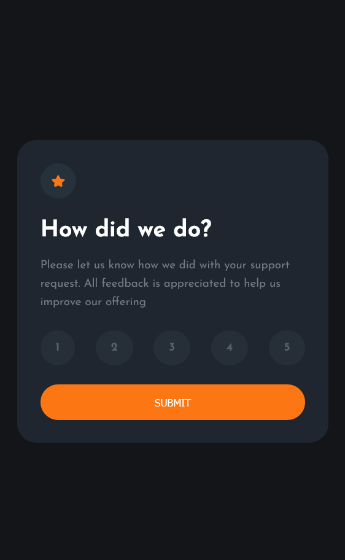

# Frontend Mentor - Interactive rating component solution

This is a solution to the [Interactive rating component challenge on Frontend Mentor](https://www.frontendmentor.io/challenges/interactive-rating-component-koxpeBUmI). Frontend Mentor challenges help you improve your coding skills by building realistic projects.

## Table of contents

- [The challenge](#the-challenge)
- [Screenshot](#screenshot)
- [Links](#links)
- [Built with](#built-with)
- [What I learned](#what-i-learned)
- [Author](#author)

### The challenge

Users should be able to:

- View the optimal layout for the app depending on their device's screen size
- See hover states for all interactive elements on the page
- Select and submit a number rating
- See the "Thank you" card state after submitting a rating

### Screenshot

### Links

- Solution URL: [Solution](https://www.frontendmentor.io/solutions/responsive-rating-page-built-with-html5-css3-and-javascript-eEs1iiwy-o)
- Live Site URL: [Live Site](https://ganbnuray.github.io/Interactive-rating-component/)

### Built with

- Semantic HTML5 markup
- CSS custom properties
- Flexbox
- JavaScript

### What I learned

I learned how to work with JavaScript to add funcitonalities to the webpages more effectively and had been able to practise my coding skills on this project.

## Author

- Frontend Mentor - [@ganbnuray](https://www.frontendmentor.io/profile/ganbnuray)
- Github - [@ganbnuray](https://github.com/ganbnuray)

